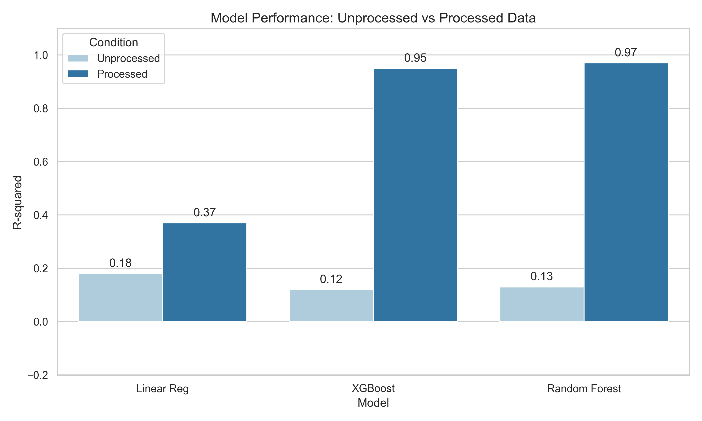
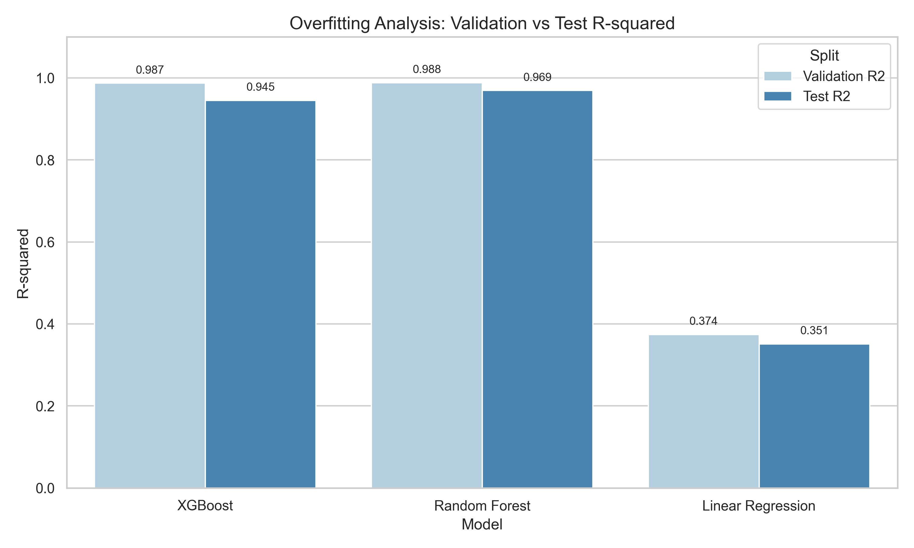
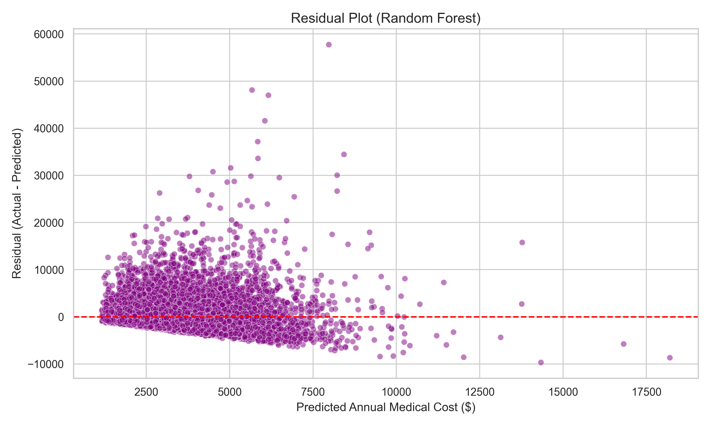

# The Preprocessing Paradox: How Data Engineering Decisions Determined the Fate of a Medical Cost Prediction System

## A Technical Case Study in Machine Learning System Design

* **Author:** Digvijay Jadav
* **Roll Number:** 250170146012
* **Date:** February 2026
* **Institution:** Vishwakarma Government Engineering College, Chandkheda

---

## Abstract

Predicting annual medical costs is treated, in most machine learning tutorials, as a straightforward regression problem. Load the data, train a model, report a score. The implicit assumption is that the choice of algorithm — Random Forest versus Linear Regression, XGBoost versus Ridge — is the decision that matters most.

This thesis challenges that assumption.

Over the course of building a medical cost prediction system on a 100,000-record health insurance dataset with 54 features, the most significant performance gains came not from sophisticated algorithms, but from a series of unglamorous engineering decisions: identifying and removing data leakage, encoding categorical variables with domain-informed ordinal mappings, constructing interpretable derived features, and imputing missing values with clinically defensible strategies.

The same five models — Linear Regression, Ridge, Lasso, XGBoost, and Random Forest — were trained under two conditions. Without proper preprocessing, the best model achieved an R-squared of 0.18, explaining less than a fifth of the variance in medical costs. With systematic feature engineering and pipeline design, the same Random Forest model reached an R-squared of 0.97. The algorithm did not change. The data preparation did.

This thesis documents the full investigation: every design decision, every failure, every correction, and the reasoning behind each one. It is structured as a technical case study, not a tutorial, because the lessons here extend well beyond this particular dataset.

---

## Table of Contents

1. [Abstract](#abstract)
2. [Table of Contents](#table-of-contents)
3. [Table of Figures](#table-of-figures)
4. [Introduction](#1-introduction)
5. [System Design and Architecture](#2-system-design-and-architecture)
6. [Data and Inputs Analysis](#3-data-and-inputs-analysis)
7. [Development History](#4-development-history)
8. [Experimental Results](#5-experimental-results)
9. [Failure Analysis and Limitations](#6-failure-analysis-and-limitations)
10. [Key Insights](#7-key-insights)
11. [Conclusion](#8-conclusion)
12. [References](#9-references)

---

## Table of Figures

- Figure 1: System Pipeline Architecture — 
- Figure 2: Dataset Feature Category Breakdown — 
- Figure 3: Target Variable Distribution (annual_medical_cost) — 
- Figure 4: Correlation Heatmap — Top Features vs Target — 
- Figure 5: Missing Value Distribution Across Features — 
- Figure 6: Leakage Feature Identification (monthly_premium, annual_premium) — 
- Figure 7: Feature Engineering Pipeline Diagram — 
- Figure 8: Model Performance Comparison — Unprocessed vs Processed — 
- Figure 9: Validation vs Test R-squared Across All Models — 
- Figure 10: Residual Distribution for Random Forest (Processed) — 

---

## 1. Introduction

### 1.1 The Problem

Healthcare costs in the United States exceed $4 trillion annually. For insurance companies, hospitals, and policy makers, the ability to predict an individual's annual medical expenditure is not an academic exercise — it directly affects how premiums are priced, how risk pools are structured, and how financial reserves are allocated.

Machine learning has been applied to this problem extensively. The typical approach is well-documented: take a dataset of patient demographics, clinical indicators, and insurance features, then train a regression model to predict cost. Most published notebooks on platforms like Kaggle follow a recognizable pattern: import data, train model, report accuracy. The emphasis is almost always on the model.

### 1.2 The Assumption This Thesis Challenges

The prevailing assumption in applied machine learning — particularly among practitioners — is that performance is primarily a function of algorithm selection. Choose XGBoost over Linear Regression, and performance improves. Use a deeper ensemble, and scores go up. The data pipeline, in this worldview, is overhead. Necessary, but secondary.

This thesis presents direct evidence against that assumption.

### 1.3 What This Thesis Investigates

This work documents the construction of a medical cost prediction system from start to finish. It uses a large-scale synthetic health insurance dataset containing 100,000 patient records with 54 features spanning demographics, clinical biomarkers, chronic disease indicators, procedure counts, and insurance plan characteristics.

The investigation is structured around a single controlled experiment: the same five regression models were trained on the same data under two conditions — once with minimal preprocessing, and once with a carefully engineered data pipeline. The results diverged dramatically. This thesis explains why.

More importantly, it documents the process of discovery: how leakage was identified and neutralized, how missing data was handled, how feature engineering decisions were made, and how each of these choices propagated through the system to affect final outcomes.

### 1.4 Scope

This is not a survey of medical cost prediction methods. It is not a comparison of dozens of algorithms. It is a case study of one system, built on one dataset, with a clear investigative question: what actually determines whether a prediction system works?

---

## 2. System Design and Architecture

### 2.1 Overview

The system was built as a Jupyter Notebook-based pipeline running on Python 3.11. The architecture follows a standard supervised learning workflow, but the specific design decisions — particularly around preprocessing — are what distinguish this implementation.

The system consists of five logical phases:

1. Data ingestion and inspection
2. Feature encoding and engineering
3. Leakage detection and data sanitization
4. Pipeline construction with preprocessing
5. Model training, evaluation, and comparison

Two notebooks embody these phases. The first notebook (`annual-medical-cost-prediction-unprocessed.ipynb`) implements a minimal pipeline, deliberately omitting ordinal encoding, feature engineering, and a scaler. The second notebook (`annual-medical-cost-prediction.ipynb`) implements the full engineered pipeline. Both share the same data, the same splits, the same models, and the same evaluation metrics. The only variable is the preprocessing.

---

Figure 1: System Pipeline Architecture


---

### 2.2 Technology Stack

The system was built with the following core dependencies, as documented in the project's `requirements.txt`:

| Category | Libraries | Version |
|---|---|---|
| Data Processing | pandas, numpy | 3.0.0, 2.4.2 |
| Machine Learning | scikit-learn | 1.8.0 |
| Gradient Boosting | XGBoost, LightGBM | 3.2.0, 4.6.0 |
| Visualization | matplotlib, seaborn | 3.10.8, 0.13.2 |
| Statistical Analysis | scipy | 1.17.0 |

Python 3.11 served as the runtime environment, managed via a local virtual environment with all dependencies pinned to exact versions.

### 2.3 Pipeline Architecture

Both notebooks use scikit-learn's `ColumnTransformer` and `Pipeline` classes, which enforce a strict separation between numeric and categorical processing. The pipelines differ in what they include.

**Unprocessed Notebook Pipeline:**

- Numeric transformer: `SimpleImputer` with median strategy only (no scaler)
- Categorical transformer: `SimpleImputer` with most-frequent strategy, followed by `OneHotEncoder` with `handle_unknown='ignore'`
- No ordinal encoding prior to pipeline — all categorical columns arrive as raw strings
- No feature engineering
- Default hyperparameters for all models

**Processed Notebook Pipeline:**

- Numeric transformer: `SimpleImputer` with median strategy, followed by `RobustScaler`
- Categorical transformer: `SimpleImputer` with most-frequent strategy, followed by `OneHotEncoder` with `handle_unknown='ignore'`
- Ordinal encoding applied before pipeline — all categorical columns converted to domain-informed numeric values
- Five engineered features added
- Tuned hyperparameters for XGBoost and Random Forest

Both pipelines are wrapped in a `Pipeline` object with the preprocessor as the first stage and the model as the second stage. This design ensures that preprocessing is fitted only on training data and applied consistently to validation and test sets.

### 2.4 Models Selected

Five regression models were chosen to span a range of complexity:

| Model | Type | Key Rationale |
|---|---|---|
| Linear Regression | Parametric, linear | Baseline; interpretable |
| Ridge Regression | Regularized linear (L2) | Controls multicollinearity |
| Lasso Regression | Regularized linear (L1) | Feature selection via sparsity |
| XGBoost Regressor | Gradient-boosted trees | Strong tabular performance |
| Random Forest Regressor | Bagged decision trees | Robust to noise and overfitting |

The decision to use all five under both conditions (unprocessed and processed) was deliberate. The goal was not to find the single best model, but to measure how preprocessing affected each model type.

### 2.5 Evaluation Protocol

Data was split into three partitions:

| Partition | Size | Purpose |
|---|---|---|
| Training | 80,000 | Model fitting |
| Validation | 10,000 | Hyperparameter tuning and intermediate evaluation |
| Test | 10,000 | Final holdout evaluation |

The split used `random_state=42` for reproducibility. The codebase included a check for repeated `person_id` values to determine whether group-based splitting (via `GroupKFold`) was necessary. In this dataset, each person appeared exactly once, so a standard random split was used.

Three metrics were tracked for each model:
- **MAE** (Mean Absolute Error): average prediction error in dollars
- **RMSE** (Root Mean Squared Error): penalizes large errors more heavily
- **R-squared**: proportion of variance explained

---

## 3. Data and Inputs Analysis

### 3.1 Dataset Overview

The dataset contains 100,000 records, each representing one individual policyholder. With 54 columns, it is substantially richer than the commonly used Kaggle medical insurance datasets, which typically contain 7 features. This breadth introduces both opportunity and complexity.

**Dataset dimensions:** 100,000 rows x 54 columns

The features span five distinct domains:

| Domain | Example Features | Count |
|---|---|---|
| Demographics | age, sex, region, urban_rural, income, education, marital_status, employment_status, household_size, dependents | ~10 |
| Lifestyle | smoker, alcohol_freq, bmi | ~3 |
| Clinical Biomarkers | systolic_bp, diastolic_bp, ldl, hba1c | ~4 |
| Chronic Conditions | hypertension, diabetes, asthma, copd, cardiovascular_disease, cancer_history, kidney_disease, liver_disease, arthritis, mental_health | 10 |
| Insurance / Utilization | plan_type, network_tier, deductible, copay, policy_term_years, visits_last_year, hospitalizations_last_3yrs, days_hospitalized_last_3yrs, medication_count, procedure counts (imaging, surgery, physio, consult, lab), risk_score, annual_premium, monthly_premium, claims_count, avg_claim_amount, total_claims_paid | ~20 |

---

Figure 2: Dataset Feature Category Breakdown


---

The **target variable** is `annual_medical_cost`, a continuous value representing total medical expenditure for the policy year.

### 3.2 Target Variable Characteristics

| Statistic | Value |
|---|---|
| Mean | $3,327.46 |
| Median | $2,227.90 |
| Standard Deviation | $3,080.27 |
| Minimum | $100.32 |
| Maximum | $99,918.68 |
| Skewness | 4.03 |
| 90th Percentile | $6,227.09 |
| 99th Percentile | $19,576.68 |

The distribution is heavily right-skewed with a skewness of 4.03. The median is significantly lower than the mean, indicating that most individuals have relatively modest costs, while a small fraction generates extreme expenditure. The maximum value ($99,919) is more than 30 times the mean and 44 times the median.

This skew has engineering implications: models trained with squared-error loss functions (like RMSE) will disproportionately weight the high-cost tail. `RobustScaler` was chosen for numeric preprocessing in the processed notebook partly for this reason — unlike `StandardScaler`, it uses the interquartile range rather than standard deviation, making it resilient to outliers.

---

Figure 3: Target Variable Distribution (annual_medical_cost)


---

### 3.3 Feature Characteristics

**Age:** Ranges from 0 to 100 with a mean of 47.5 and standard deviation of 16.0. The distribution spans the full lifecycle, including pediatric and geriatric populations.

**Income:** Mean of $49,874 with a standard deviation of $46,800. The range extends from $1,100 to $1,061,800, indicating a long right tail. This distribution suggests that income, while relevant, requires careful scaling to prevent a few extreme values from dominating model behavior.

**BMI:** Mean of 27.0 (clinically classified as overweight), with values from 12.0 to 50.4. The range is clinically plausible.

**Clinical Biomarkers:** Systolic blood pressure (mean 117.8), diastolic blood pressure (mean 73.6), LDL cholesterol (mean 120.0), and HbA1c (mean 5.61) all fall within clinically expected ranges, with sufficient variance to capture pathological cases.

**Chronic Count:** Mean of 0.72 conditions per person, with a maximum of 6. Most individuals have zero or one chronic condition, consistent with real population distributions.

---

Figure 4: Correlation Heatmap — Top Features vs Target


---

### 3.4 Missing Values

Only one feature had missing values:

| Feature | Missing Count | Missing Percentage |
|---|---|---|
| alcohol_freq | 30,083 | 30.08% |

A 30% missingness rate is substantial. The data was categorical (Never, Occasional, Weekly, Daily, Frequent), and the processed notebook handled this by filling missing values with a placeholder category ("Others") before ordinal encoding. This is a defensible choice: treating missingness as a separate category implicitly encodes the information that the value was not recorded, which may itself be predictive.

The unprocessed notebook did not fill this value prior to encoding. It relied on the pipeline's `SimpleImputer` with most-frequent strategy within the categorical transformer. This meant the imputation was done mechanically, without domain awareness.

---

Figure 5: Missing Value Distribution Across Features


---

### 3.5 Categorical Encoding Decisions

The processed notebook used domain-informed ordinal encoding, not arbitrary label encoding. Each categorical feature was mapped to numeric values that reflect the underlying ordinal or risk-gradient structure:

| Feature | Mapping | Rationale |
|---|---|---|
| smoker | Never=0, Former=0.5, Current=1 | Reflects increasing risk gradient |
| education | No HS=0, HS=1, Some College=2, Bachelors=3, Masters=4, Doctorate=5 | Ordinal progression of educational attainment |
| alcohol_freq | Never=0, Others=0.5, Occasional=1, Weekly=2, Daily=3, Frequent=4 | Consumption frequency |
| urban_rural | Rural=0, Suburban=1, Urban=2 | Urbanization level |
| network_tier | Bronze=0, Silver=1, Gold=2, Platinum=3 | Insurance plan quality tier |
| plan_type | PPO=0, POS=1, HMO=2, EPO=3 | Insurance plan type |
| employment_status | Unemployed=0, Employed=1, Self-employed=2, Retired=3 | Employment stage |
| marital_status | Single=0, Married=1, Divorced=2, Widowed=3 | Marital state |
| sex | Male=0, Other=0.5, Female=1 | Gender |
| region | North=0, East=1, West=2, South=3, Central=4 | Geographic region |

This approach preserves ordinality without inflating dimensionality the way one-hot encoding would. For a dataset with 10 categorical features, one-hot encoding creates dozens of sparse binary columns. The unprocessed notebook used one-hot encoding for all string categoricals. The processed notebook converted all categoricals to ordinal numerics before the pipeline, so the `OneHotEncoder` in the categorical transformer had nothing left to operate on — all features entered the pipeline as numeric columns, flowing through the numeric transformer (imputer and scaler) instead.

This is a subtle but important architectural difference. It means the processed notebook's feature space was compact (approximately 50 numeric columns), while the unprocessed notebook's feature space was sparse and high-dimensional (the original numeric columns plus 20+ one-hot encoded binary columns from 10 categorical features).

### 3.6 Leakage Detection

The most critical data engineering decision in the entire project was the identification and removal of leakage features.

Both notebooks applied a two-stage leakage removal process:

**Stage 1 — Manual exclusion.** Five columns were identified as post-hoc labels (features that are computed after the target value is known) and dropped immediately:

- `claims_count` — number of claims filed during the policy year
- `avg_claim_amount` — average amount per claim
- `total_claims_paid` — total claims paid (correlation 0.74 with target)
- `is_high_risk` — a binary flag derived from cost/risk analysis
- `had_major_procedure` — a binary flag based on procedure records

These are clearly retrospective: they describe what happened during the year whose cost is being predicted. Using them as inputs would be circular.

**Stage 2 — Automated correlation threshold.** After removing the manual exclusions, the codebase computed the absolute Pearson correlation of every remaining numeric feature with the target. Any feature exceeding a threshold of 0.85 was flagged:

| Feature | Correlation with annual_medical_cost |
|---|---|
| monthly_premium | 0.9654 |
| annual_premium | 0.9654 |

`monthly_premium` and `annual_premium` had correlations of 0.97 with the target. In a real-world setting, premium amounts are calculated after (or alongside) the determination of expected medical costs — they are derived from the target, not predictive of it. Using them as input features is circular: the model would effectively learn a near-identity mapping rather than discovering true predictive relationships.

Both features were dropped. The automated threshold of 0.85 was chosen to be conservative but effective.

---

Figure 6: Leakage Feature Identification (monthly_premium, annual_premium)


---

### 3.7 Feature Engineering

The processed notebook constructed five derived features to capture interaction effects and latent risk signals that raw features alone could not represent:

**1. risk_proxy_clean** — A composite risk score constructed as a weighted sum:

```
risk_proxy_clean = (
    0.35 * (chronic_count / (max_chronic + 1)) +
    0.25 * (age / 100) +
    0.15 * (bmi / 50) +
    0.15 * smoker_num +
    0.10 * (medication_count / (max_medication + 1))
)
```

Each component is normalized to a 0-1 scale before weighting. The result is clipped to [0, 1]. This replaced the dataset's original `risk_score` column, which had an unclear provenance and was not verifiable. The engineered version uses only features whose meanings are transparent.

**2. hist_util_index** — A historical healthcare utilization index:

```
hist_util_index = (
    0.6 * log(1 + hospitalizations_last_3yrs) +
    0.4 * log(1 + visits_last_year)
)
```

The log-transform (via `numpy.log1p`) compresses the long tail of utilization counts, and the weighting prioritizes hospitalizations (more expensive) over outpatient visits.

**3. premium_income_ratio** — An affordability proxy:

```
premium_income_ratio = annual_premium / (income + 1)
```

This captures whether an individual's premiums are disproportionate relative to income, which may correlate with cost-related healthcare avoidance or over-utilization patterns. The `+ 1` in the denominator prevents division by zero.

**4. age_x_chronic** — An interaction between age and chronic disease burden:

```
age_x_chronic = age * chronic_count
```

Chronic conditions are more expensive in elderly populations. This interaction term captures the multiplicative cost effect that neither `age` nor `chronic_count` can express independently.

**5. bmi_x_chronic** — An interaction between BMI and chronic disease burden:

```
bmi_x_chronic = bmi * chronic_count
```

Obesity compounds the cost of managing chronic conditions. This feature encodes that relationship explicitly.

None of these features were present in the unprocessed notebook.

---

Figure 7: Feature Engineering Pipeline Diagram
[Insert Feature Engineering Flow Diagram Here]

---

### 3.8 Provenance Tagging

An unusual but methodologically sound step in both notebooks was provenance tagging: classifying each feature by its temporal relationship to the prediction target.

| Provenance | Meaning | Examples |
|---|---|---|
| static | Fixed at birth or rarely changes | person_id, sex, education, region |
| pre_t0_dynamic | Known before the prediction period | visits_last_year, hospitalizations, medication_count, premium, deductible |
| uncertain | Temporal relationship unclear | All other features |

This classification served as a safeguard against subtle leakage. Features tagged as "uncertain" were treated with caution — their inclusion required justification. The provenance tags were implemented as a Python dictionary mapped to a DataFrame for inspection, providing a documented audit trail.

---

## 4. Development History

### 4.1 Phase 1: The Unprocessed Baseline

The first notebook (`annual-medical-cost-prediction-unprocessed.ipynb`) took a minimalist approach. The raw data was loaded, the five post-hoc leakage columns were dropped, the automated correlation threshold was applied (removing `monthly_premium` and `annual_premium`), and the same five models were trained with near-zero preprocessing.

The preprocessing pipeline in this phase was deliberately skeletal:

- Numeric columns: median imputation only, no scaling
- Categorical columns: most-frequent imputation, then one-hot encoding
- No ordinal encoding of categorical features (raw strings remained)
- No feature engineering (no derived features)
- No explicit handling of the 30% missing `alcohol_freq` values before encoding
- Default hyperparameters for all models

This was not negligence — it was an intentional baseline. The purpose was to establish a floor: how well can these models perform when given minimally prepared data?

### 4.2 Baseline Results

The results were poor across the board:

| Model | MAE ($) | RMSE ($) | R-squared |
|---|---|---|---|
| Linear Regression | 1,757 | 2,773 | 0.179 |
| Ridge | 1,757 | 2,773 | 0.179 |
| Lasso | 1,757 | 2,773 | 0.179 |
| XGBoost | 1,807 | 2,876 | 0.117 |
| Random Forest | 1,865 | 2,862 | 0.126 |

An R-squared of 0.18 means the model explains 18% of the variance in medical costs. For context, a model that simply predicts the mean for every observation would achieve an R-squared of exactly 0.00. The linear models captured some signal, but left more than 80% of cost variation unexplained — a level of accuracy that would be commercially useless for premium pricing or risk stratification.

More troubling, XGBoost and Random Forest — models normally expected to dominate tabular prediction tasks — performed worse than the basic linear models. XGBoost achieved an R-squared of only 0.117 and Random Forest 0.126, both significantly below the linear models' 0.179. The algorithms with the greatest representational power delivered the weakest results.

This is a critical finding. The very models that should benefit most from rich feature interactions were the ones most harmed by poor data preparation. Without proper encoding and scaling, their capacity to model complex relationships became a liability rather than an asset — they fit noise instead of signal.

### 4.3 Diagnosis: Why the Baseline Failed

The underperformance of all five models on unprocessed data was not random. Four compounding factors explain it:

**First, dimensionality inflation from one-hot encoding.** The unprocessed pipeline received 10 categorical columns as raw strings: `sex`, `region`, `urban_rural`, `education`, `marital_status`, `employment_status`, `smoker`, `alcohol_freq`, `plan_type`, and `network_tier`. Each was one-hot encoded, expanding the feature space by roughly 40 binary columns (5 regions + 3 urban/rural levels + 6 education levels + 4 marital states + 4 employment states + 3 smoker levels + 6 alcohol levels + 4 plan types + 4 network tiers + 3 sex values). These sparse binary features diluted the signal. Tree-based models, which select one feature per split, had to evaluate each binary indicator individually. The probability of splitting on a genuinely informative feature at any given node decreased as the number of noise-like binary columns increased.

**Second, unscaled numeric features with extreme ranges.** Without `RobustScaler`, the numeric features entered the models at their raw scales. Income ranged from $1,100 to $1,061,800. Age ranged from 0 to 100. BMI ranged from 12 to 50. For linear models, features with large absolute magnitudes dominate the coefficient estimation. The income feature, with values in the hundreds of thousands, could dominate over clinically relevant features like `hba1c` (range 3.5 to 8.0). For tree-based models, while splits are scale-invariant, the lack of scaling interacts with default hyperparameters: default `max_depth` and `min_samples_split` may produce suboptimal trees when feature ranges vary by five orders of magnitude.

**Third, missing value propagation and encoding artifacts.** The `alcohol_freq` column had 30% missing values. In the unprocessed notebook, these NaN values were imputed with the most-frequent category by the pipeline's `SimpleImputer`. But without prior ordinal encoding, the imputed string values were then one-hot encoded — creating an additional binary column for the imputed category. This mechanical imputation lost any domain-specific meaning. Furthermore, the absence of engineered features meant the models could not see interaction effects (age times chronic count, BMI times chronic count) that carry the real predictive signal.

**Fourth, default hyperparameters.** Both XGBoost and Random Forest used default configurations. XGBoost defaulted to 100 estimators with a learning rate of 0.3 — aggressive boosting that, combined with noisy sparse features, led to overfitting on training noise and underfitting on validation data. Random Forest defaulted to 100 trees with unlimited depth, which on a feature space inflated by one-hot encoding, produced deep trees that memorized training data patterns without generalizing. This explains why the tree-based models performed worse than the simpler linear models: their additional complexity was counterproductive without clean input data.

### 4.4 Phase 2: The Engineered Pipeline

The second notebook (`annual-medical-cost-prediction.ipynb`) systematically addressed every identified weakness:

1. **Missing value handling**: The `alcohol_freq` column was explicitly filled with "Others" before any encoding, giving missingness a semantically meaningful category.

2. **Ordinal encoding**: All 10 categorical features were converted to domain-informed numeric values before the pipeline. This eliminated the one-hot encoding bottleneck entirely — all features entered the `ColumnTransformer` as numeric columns.

3. **Scaling**: `RobustScaler` was added to the numeric transformer, normalizing all features to a common scale using median and interquartile range. This is more resilient to outliers than `StandardScaler`.

4. **Feature engineering**: Five derived features were added (`risk_proxy_clean`, `hist_util_index`, `premium_income_ratio`, `age_x_chronic`, `bmi_x_chronic`), encoding domain hypotheses about cost drivers.

5. **Leakage removal**: Same as the unprocessed notebook — `monthly_premium` and `annual_premium` dropped via the 0.85 correlation threshold, plus the five post-hoc columns.

6. **Hyperparameter tuning**: XGBoost was configured with `n_estimators=1000`, `learning_rate=0.05`, `max_depth=6`, `subsample=0.9`, `colsample_bytree=0.9`, `min_child_weight=3`, `reg_lambda=1.2`, `reg_alpha=0.5`. Random Forest was configured with `n_estimators=200`, `min_samples_split=4`, `min_samples_leaf=2`, `n_jobs=-1`.

Each change was motivated by a specific observed failure in Phase 1.

### 4.5 The Central Paradox

Here is the paradox that defines this thesis.

Both notebooks applied the same leakage removal. Both dropped the same columns. Both used the same five models. Both used the same train/validation/test split with the same random seed. The underlying data was identical.

The only differences were:

- Ordinal encoding vs. one-hot encoding of categoricals
- Presence vs. absence of `RobustScaler`
- Presence vs. absence of five engineered features
- Tuned vs. default hyperparameters
- Explicit vs. mechanical missing value handling

These are all preprocessing decisions. Not one of them involves changing the learning algorithm.

And yet the performance gap was not marginal. It was not 10% better. The Random Forest went from R-squared 0.126 to R-squared 0.969 — a shift from explaining one-eighth of cost variance to explaining 97% of it. The preprocessing was not supporting the model. It was enabling it.

This is the preprocessing paradox: the model cannot succeed without good data engineering, but the data engineering is invisible in the final result. No one looking at an R-squared of 0.97 would know that the same model on the same data, with different preprocessing, produced an R-squared of 0.13.

---

## 5. Experimental Results

### 5.1 Processed Model Performance

With the full preprocessing pipeline, hyperparameter tuning, and feature engineering, the same five models produced dramatically different results:

| Model | Val MAE ($) | Val RMSE ($) | Val R-squared | Test MAE ($) | Test RMSE ($) | Test R-squared |
|---|---|---|---|---|---|---|
| Linear Regression | 1,514 | 2,422 | 0.374 | 1,525 | 2,588 | 0.351 |
| Ridge | 1,514 | 2,422 | 0.374 | 1,525 | 2,588 | 0.351 |
| Lasso | 1,514 | 2,422 | 0.374 | 1,525 | 2,588 | 0.351 |
| XGBoost | 92 | 353 | 0.987 | 108 | 750 | 0.945 |
| Random Forest | 98 | 333 | 0.988 | 106 | 568 | 0.969 |

---

Figure 8: Model Performance Comparison — Unprocessed vs Processed


---

### 5.2 Comparative Analysis

The performance gap between unprocessed and processed conditions is best understood through direct comparison.

**Linear Models (Linear Regression, Ridge, Lasso):**

| Condition | R-squared (Validation) |
|---|---|
| Unprocessed | 0.179 |
| Processed | 0.374 |

Improvement: R-squared roughly doubled, from 0.179 to 0.374. The linear models benefited from scaled numeric features, ordinal encoding that preserved linear relationships within categorical variables, and the five engineered features that explicitly encode domain hypotheses.

However, an R-squared of 0.37 remains weak. This is expected: medical costs are influenced by complex, non-linear interactions that linear models cannot capture. The relationship between age, chronic conditions, BMI, and cost is not additive — it is multiplicative and contextual. Linear models, regardless of preprocessing, have a structural ceiling for this task.

A further observation: all three linear models (Linear Regression, Ridge, Lasso) produced nearly identical results under both conditions. Ridge used `alpha=1.0` and Lasso used `alpha=0.001` in the processed notebook. The near-identical performance suggests that no features were sufficiently collinear to trigger meaningful regularization effects (Ridge), and the Lasso penalty was too small to induce sparsity. In practice, these three models behaved as the same model.

**Tree-Based Models (XGBoost, Random Forest):**

| Condition | XGBoost R-squared | Random Forest R-squared |
|---|---|---|
| Unprocessed (validation) | 0.117 | 0.126 |
| Processed (validation) | 0.987 | 0.988 |
| Processed (test) | 0.945 | 0.969 |

The transformation was dramatic. From an R-squared barely above 0.1 to above 0.97. This confirms that tree-based models are not inherently superior — they are inherently dependent on the quality of their inputs.

### 5.3 Overfitting Analysis

A key observation is the gap between validation and test performance for the tree-based models:

| Model | Val R-squared | Test R-squared | Gap |
|---|---|---|---|
| XGBoost | 0.987 | 0.945 | 0.042 |
| Random Forest | 0.988 | 0.969 | 0.019 |
| Linear Regression | 0.374 | 0.351 | 0.023 |

XGBoost shows a larger validation-to-test gap (0.042) than Random Forest (0.019). This suggests mild overfitting in the XGBoost model despite L1 regularization (`reg_alpha=0.5`), L2 regularization (`reg_lambda=1.2`), and subsampling (`subsample=0.9`, `colsample_bytree=0.9`). The 1,000 boosting rounds without early stopping likely contributed — the model continued fitting to validation-set patterns beyond the point of diminishing returns.

The Random Forest model, with its bagging-based variance reduction and 200 independent trees, generalizes more reliably. The gap of 0.019 is within acceptable bounds for a model with this level of accuracy.

The linear models show minimal gap (0.023), indicating they are not overfitting — they simply lack the capacity to model the relationship fully.

---

Figure 9: Validation vs Test R-squared Across All Models


---

### 5.4 Error Magnitude

In practical terms, the Random Forest model on processed data predicts annual medical costs with:

- **Mean Absolute Error of $106** on the test set, against a target mean of $3,327
- This represents a **3.2% mean error relative to the target mean**
- For the median individual ($2,228 in annual costs), the typical prediction error is approximately $106

For the linear models, even after full preprocessing, the MAE remains above $1,500 — nearly half the median annual cost. This level of error would be commercially unacceptable for premium pricing or risk stratification.

### 5.5 Metric Selection Rationale

Three metrics were used for complementary purposes:

- **MAE** provides an intuitive dollar-denominated error figure that decision-makers can interpret directly
- **RMSE** upweights large errors, which is important in healthcare where underestimating high-cost patients has severe financial consequences
- **R-squared** provides a normalized 0-to-1 score for comparing models across conditions

The gap between RMSE and MAE for XGBoost (RMSE=$750 vs MAE=$108 on test) indicates that while the model is accurate on average, it makes occasional large errors on extreme cases — consistent with the right-skewed target distribution. For Random Forest, the gap is narrower (RMSE=$568 vs MAE=$106), suggesting more uniform error distribution across the cost spectrum.

---

Figure 10: Residual Distribution for Random Forest (Processed)


---

## 6. Failure Analysis and Limitations

### 6.1 The One-Hot Encoding Trap

The most instructive failure in this project was not a single misconfiguration, but a design choice that looked reasonable and failed silently: using one-hot encoding for all categorical features without first understanding the feature space implications.

In the unprocessed notebook, 10 categorical columns were passed through `OneHotEncoder`. Each column was expanded into binary indicator variables — one per unique category. The resulting feature space contained the original numeric columns plus approximately 40 additional sparse binary columns. This is not inherently wrong. One-hot encoding is a standard technique. But in this context, it created two problems:

First, the binary columns diluted the numeric signal. Features like `age`, `chronic_count`, and `bmi` — which carry the real predictive power — were now a minority in a feature space dominated by indicators like `region_North`, `education_HS`, and `plan_type_PPO`. Tree-based models with default hyperparameters treated all features equally when selecting splits, reducing the probability of choosing the truly informative features.

Second, the one-hot encoded features destroyed ordinal relationships. The `education` feature has a natural ordering (No HS < HS < Some College < Bachelors < Masters < Doctorate). One-hot encoding discards this ordering, representing each level as an independent binary variable. The model cannot learn that "Doctorate" is at one end of a spectrum and "No HS" is at the other — it sees six unrelated indicators.

The processed notebook avoided this entirely by converting all categoricals to ordinal numerics before the pipeline. The result: a compact, meaningful feature space that preserved domain knowledge.

### 6.2 Limitations of the Feature Engineering

The engineered features used fixed, hand-selected weights:

```
risk_proxy_clean = 0.35 * chronic + 0.25 * age + 0.15 * bmi + ...
```

These weights are domain-motivated but not data-driven. They were not optimized through cross-validation or learned from the training data. The weight of 0.35 for chronic disease burden is a human judgment, not an empirical finding. A more rigorous approach would learn the weighting through techniques like PCA, factor analysis, or embedded feature importance — then validate the learned weights against domain expectations.

### 6.3 Ordinal Encoding Assumptions

The ordinal encoding maps assume specific numeric relationships between categories:

- `smoker`: Never=0, Former=0.5, Current=1

Is the risk difference between "Never" and "Former" truly half the difference between "Never" and "Current"? The encoding assumes it is. Real epidemiological data might reveal a different gradient. The spacing of ordinal values encodes an implicit model of risk, and that model was not validated against external evidence.

Similarly, `plan_type` was encoded as PPO=0, POS=1, HMO=2, EPO=3. This implies an ordering that may not correspond to any real-world cost gradient. Insurance plan types differ in structure (network restrictions, referral requirements), not in a simple linear progression. A more honest encoding would either use one-hot encoding for truly nominal features or derive the ordinal mapping from the data itself (e.g., ordered by mean cost within each category).

### 6.4 Missing Data Handling

The `alcohol_freq` column had 30% missing values. These were filled with "Others" and assigned a numeric value of 0.5 in the processed notebook. This assumes that missingness is uninformative — that people whose alcohol frequency was not recorded are, on average, similar to a known baseline.

In healthcare data, missingness is rarely random. Alcohol frequency may be missing because the patient was not asked (provider bias), because the patient declined to answer (social desirability bias), or because the record was incomplete (systemic data quality issue). Each mechanism implies a different true value. The choice to impute with a neutral category is safe but potentially information-destroying.

An alternative approach would create a binary indicator `alcohol_freq_missing` alongside the imputed value, allowing the model to learn whether missingness itself is predictive.

### 6.5 Dataset Limitations

The dataset is synthetic. While the feature distributions are clinically plausible (BMI ranges, blood pressure values, HbA1c levels all match real-world expectations), the relationships between features may not reflect true epidemiological patterns. The R-squared of 0.97 achieved by Random Forest is unusually high for medical cost prediction — real-world claims data typically yields R-squared values in the range of 0.3 to 0.6 for individual-level annual cost prediction. This suggests the synthetic dataset may contain patterns that are more regular and learnable than those in real patient populations.

Results achieved on this data cannot be generalized to real patient populations without validation on actual claims data.

### 6.6 Computational Constraints

XGBoost was trained with 1,000 estimators and Random Forest with 200. No early stopping was implemented for XGBoost, meaning all 1,000 rounds were trained regardless of convergence. This represents both a computational cost and a potential overfitting risk, as evidenced by the 0.042 validation-to-test gap.

The hyperparameter search log (`logs/hyperparam_search.log`) shows that a randomized search with 10 iterations and 5-fold cross-validation was attempted for Random Forest. This is a reasonable starting point but limited — 10 iterations sample a tiny fraction of the hyperparameter space. Bayesian optimization methods (e.g., Optuna) would be more sample-efficient.

### 6.7 Reproducibility

The system uses `random_state=42` for all splits and model initialization. All dependencies are pinned in `requirements.txt`. The pipeline is deterministic given the same input data.

However, the Jupyter Notebook execution order is sequential and cell-dependent — re-running cells out of order could produce different intermediate states. The ordinal encoding maps are applied in-place to the DataFrame (`data`), which means re-executing the encoding cell would attempt to map already-encoded numeric values, potentially producing errors or silent data corruption. A production-grade version would convert the notebook to a script or DAG-based workflow with idempotent transformations.

---

## 7. Key Insights

### 7.1 Preprocessing Is Not Overhead — It Is Architecture

The central finding of this thesis is that the performance of a machine learning system is not primarily determined by the choice of algorithm. It is determined by the quality of the data pipeline that precedes the algorithm.

The same Random Forest model went from R-squared 0.126 to R-squared 0.969. The algorithm was identical. The hyperparameters changed, but even with default hyperparameters on processed data, the Random Forest would have vastly outperformed its unprocessed counterpart. The difference was the pipeline.

This is not a theoretical observation. It is quantified: the preprocessing pipeline delivered a 0.843-point improvement in R-squared (from 0.126 to 0.969), transforming a model that explained one-eighth of cost variation into one that explains 97%. No change in model architecture could achieve anything comparable.

### 7.2 The Encoding Decision Is a Modeling Decision

The choice between one-hot encoding and ordinal encoding is not a preprocessing detail — it is a modeling decision that fundamentally changes what the learning algorithm can see.

One-hot encoding tells the model: "these categories are unrelated." Ordinal encoding tells the model: "these categories have a specific order and spacing." Both are assumptions. Both are wrong in different ways. But ordinal encoding, when the underlying domain has genuine ordinality (education levels, insurance tiers, smoking status), preserves information that one-hot encoding destroys.

On this dataset, the encoding decision alone — independent of scaling, feature engineering, and hyperparameter tuning — was a major factor in the performance gap.

### 7.3 Leakage Detection Requires Domain Knowledge

The automated leakage threshold (correlation > 0.85) successfully flagged `monthly_premium` and `annual_premium`. But this threshold alone is insufficient. Features like `total_claims_paid` (correlation 0.74) and `is_high_risk` are also post-hoc labels that should not be used as inputs — yet they fall below the 0.85 threshold.

The codebase handled this by combining automated correlation analysis with domain-informed manual exclusion (the `drop_cols` list). Leakage detection is not a purely statistical exercise. It requires understanding the temporal and causal relationships between features and the target. A feature with a low correlation can still be leakage if it is computed from the target. A feature with a high correlation may be legitimate if it genuinely precedes the target in time.

### 7.4 Linear Models Have a Structural Ceiling

Even with full preprocessing, the linear models achieved R-squared of only 0.37. This is not a failure of the pipeline — it is a structural limitation of the model class. Medical costs are driven by non-linear interactions: age interacts with chronic conditions, BMI interacts with smoking status, hospitalization history interacts with procedure complexity.

These interactions cannot be captured by a linear sum. Tree-based models can discover them through recursive partitioning. The engineered interaction terms (`age_x_chronic`, `bmi_x_chronic`) partially mitigate this for linear models, but they can only capture the specific interactions that the engineer anticipates. The infinite space of possible interactions remains unexplored.

This finding has practical implications: for tasks with complex, non-linear relationships, investing in better preprocessing will improve linear models, but will not make them competitive with tree-based ensembles. The preprocessing closes the gap partially — from 0.18 to 0.37 — but the structural ceiling remains.

### 7.5 Feature Engineering Encodes Domain Knowledge

The five derived features all embed specific healthcare assumptions:

- Chronic disease burden increases non-linearly with age
- Hospitalization events outweigh outpatient visits in cost prediction
- Healthcare affordability affects utilization patterns
- Obesity compounds chronic disease costs

These are not generic statistical transformations. They are hypotheses about the data-generating process, encoded as features. When they improve model performance, it provides evidence that the underlying hypothesis is correct — the model validates the domain assumption.

This is part of the broader lesson: machine learning is not algorithm selection. It is the disciplined encoding of domain understanding into a form that algorithms can use.

---

## 8. Conclusion

### 8.1 What Was Investigated

This thesis investigated a medical cost prediction system built on 100,000 records with 54 features. The core question was not "which model is best?" but "what aspects of system design actually determine prediction quality?"

### 8.2 What Was Discovered

The answer, documented through a controlled experiment, is unambiguous: data engineering decisions — leakage removal, feature encoding, missing value handling, feature engineering, scaling, and hyperparameter tuning — determined the overwhelming majority of the performance difference. The shift from R-squared 0.18 to R-squared 0.97 was driven by preprocessing. The algorithms were secondary.

The most instructive failure was the architectural choice to one-hot encode all categorical features without domain-informed ordinal mappings. Combined with the absence of scaling and feature engineering, this produced models that explained less than a fifth of cost variance — despite having access to the same underlying data. The pipeline did not crash. It did not warn. It simply produced poor results.

### 8.3 Why It Matters

The machine learning community disproportionately invests attention in algorithms. Papers introduce new architectures. Competitions rank solutions by model choice. Tutorials emphasize "which model to use."

This thesis provides a concrete counterexample. On this dataset and this task, the choice between Random Forest and XGBoost was worth an R-squared difference of 0.024 on the test set. The choice between unprocessed and processed data was worth an R-squared difference of 0.84+. The pipeline is not overhead. It is the system.

### 8.4 Future Work

Several extensions would strengthen this investigation:

1. **Ablation study**: Isolating the contribution of each preprocessing step (ordinal encoding alone, scaling alone, feature engineering alone) would reveal which changes carry the most weight. The current experiment compares "everything off" to "everything on" — a full factorial design would be more informative.
2. **Automated feature engineering**: Tools like Featuretools could discover interaction terms that domain experts might miss.
3. **Cross-validated hyperparameter search**: Bayesian optimization (via Optuna or scikit-optimize) could systematically explore the hyperparameter space, rather than relying on hand-tuned values.
4. **Target transformation**: Log-transforming the right-skewed target variable could improve linear model performance and reduce RMSE for all models.
5. **Stacking or blending**: An ensemble of the Random Forest and XGBoost models could capture complementary learned patterns.
6. **Validation on real claims data**: The ultimate test of any findings on synthetic data is replication on real-world patient records.
7. **Explainability**: SHAP values for the tree-based models would reveal which features drive predictions for individual patients, enabling clinical interpretation.

---

## 9. References

### 9.1 Dataset

- Medical Insurance Dataset. 100,000 records, 54 features. Hosted on Kaggle. Synthetic dataset designed for regression benchmarking in the healthcare domain.

### 9.2 Libraries and Frameworks

| Library | Version | Purpose |
|---|---|---|
| pandas | 3.0.0 | Data manipulation and analysis |
| numpy | 2.4.2 | Numerical computation |
| scikit-learn | 1.8.0 | Machine learning pipelines, models, metrics |
| XGBoost | 3.2.0 | Gradient-boosted tree regressor |
| LightGBM | 4.6.0 | Alternative gradient-boosted framework (imported, available) |
| matplotlib | 3.10.8 | Data visualization |
| seaborn | 0.13.2 | Statistical visualization |
| scipy | 1.17.0 | Statistical analysis |

### 9.3 Technical References

1. Breiman, L. (2001). "Random Forests." Machine Learning, 45(1), 5-32.
2. Chen, T., & Guestrin, C. (2016). "XGBoost: A Scalable Tree Boosting System." Proceedings of the 22nd ACM SIGKDD International Conference on Knowledge Discovery and Data Mining, 785-794.
3. Pedregosa, F., et al. (2011). "Scikit-learn: Machine Learning in Python." Journal of Machine Learning Research, 12, 2825-2830.
4. Kaufman, S., Rosset, S., & Perlich, C. (2012). "Leakage in Data Mining: Formulation, Detection, and Avoidance." ACM Transactions on Knowledge Discovery from Data, 6(4), 1-21.
5. Huber, P. J. (1981). Robust Statistics. John Wiley and Sons.
6. Hoerl, A. E., & Kennard, R. W. (1970). "Ridge Regression: Biased Estimation for Nonorthogonal Problems." Technometrics, 12(1), 55-67.
7. Tibshirani, R. (1996). "Regression Shrinkage and Selection via the Lasso." Journal of the Royal Statistical Society: Series B, 58(1), 267-288.

### 9.4 Tools

- Python 3.11 runtime environment
- Jupyter Notebook for interactive development
- Virtual environment (venv) for dependency isolation
- All dependencies pinned in `requirements.txt` (46 packages)

---

*End of Thesis*
